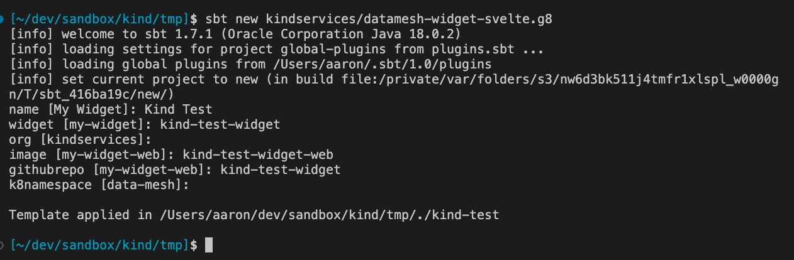
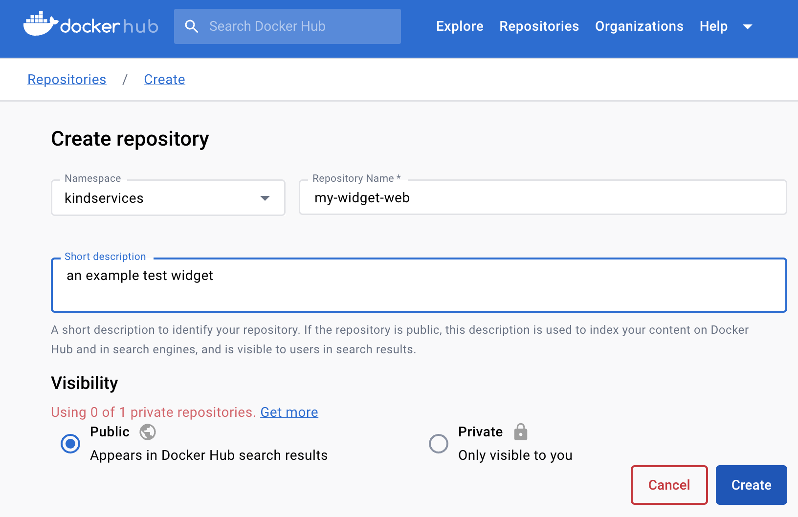
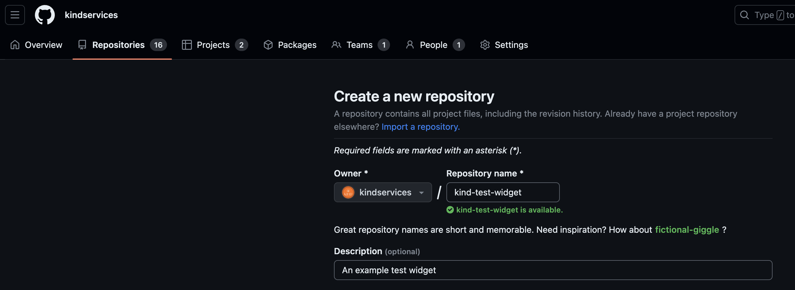

# About

The premise of the data-mesh is that it would be cheap and easy to create small, single-purpose widgets.

This template is an attempt to deliver on that promise. In a matter of seconds or minutes, somebody could:

1) use this template to bootstrap a new svelte widget
2) create a corresponding dockerhub repository
2) push their new widget to a new github repository which then publishes to dockerhub

This is possible within any organisation such as Kind which has organisation-level authorisation for github to push to dockerhub.


# Usage
## 1) Create a new widget from this template
This template depends on [sbt new](https://www.scala-sbt.org/download.html). With sbt downloaded, run:

```
sbt new kindservices/datamesh-widget-svelte.g8
```

It prompted me for some parameters with some defaults:



* Name

  A friendly name for this widget. It will be used as the <name>.svelte component

* Widget

  the lower-case, hyphen-separated name to use for the web component (e.g. \<my-web-component />)

* org

  The organisation for both the github and dockerhub accounts. (This template assumes both are called the same thing)

* image

  The name of the dockerhub repo -- or image -- which we're going to publish. Remember this value - we will need to manually create this dockerhub repo in the next step.

* githubrepo

  The name of the github repo we're going to use to push this code up to. Remember this name, as we will need to create this repo in the third step.

# k8namespace

  The kubernetes (k8s) namespace where we'll deploy this widget to. It assumes 'data-mesh', which is the same as the other components.

## 2) Create a dockerhub repo

Create or log into your [dockerhub]() account and create a repo with the same name as the 'image' you used in step 1:



## 3) Create a github repo and push

With our newly generated source code from step 1, we now go over to github to create a matching repo with the same name that we used for our  'githubrepo' parameter above:



Github kindly gives us the git code now to use for our new repo in its output:

We just have to change directory (`cd`) into our new 'kind test' directory
```
cd kind-test # <--- I added this step. The rest of the output comes from github
git init
git add -A
git commit -m "first commit"
git branch -M main
git remote add origin https://github.com/kindservices/kind-test-widget.git
git push -u origin main
```


## Setting up
To create this template, we followed the instructions on [foundweekends.org/giter8](https://www.foundweekends.org/giter8/setup.html), which were to:

1. Install [coursier](https://get-coursier.io/docs/cli-installation#macos-brew-based-installation)
```bash
brew install coursier/formulas/coursier
cs setup
```

2. Use coursier to set up giter8:
 ```base
cs install giter8 
cs update g8
which g8 && echo "g8 installed 👍"
```

# Developing

The template variables go in [default.properties](./src/main/g8/default.properties).

You can read about formatting the templates [here](https://www.foundweekends.org/giter8/formatting.html), e.g. 

```
$name;format="Camel"$
```

# Testing

With `g8` installed, we can test locally like this:
```
g8 file://. --name=uftest --force -o tmp-test
```