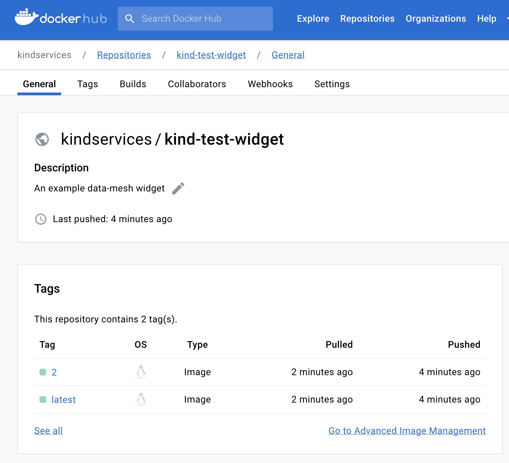

[github pages](https://kindservices.github.io/datamesh-widget-svelte.g8/) | [repo](https://github.com/kindservices/datamesh-widget-svelte.g8) | [kind services](https://www.kindservices.co.uk)

# Purpose 
The premise of the data-mesh is that developers can easily create small, single-purpose widgets. They can create and test little "mini apps" with their own delivery and maintenance lifecycle, with minimal coupling/knowledge about the rest of the application, and without impacting other teams. (i.e., 'composition over inheritance' for teams).

# About

This template is an attempt to deliver on that promise. It is a [g8 teamplate](https://www.foundweekends.org/giter8/template.html) for new svelte widgets. The process would be:

1) use this template to bootstrap a new svelte widget
2) create a corresponding dockerhub repository
2) push their new widget to a new github repository which then publishes to dockerhub

This is possible within any organisation such as Kind which has organisation-level authorisation for github to push to dockerhub.

**NOTE:** It's not necessary to use this template. The key parts are:
 * the `k8s/web.yaml` which knows how to add a [service-registry](https://github.com/kindservices/datamesh-service-registry) [sidecar](https://medium.com/bb-tutorials-and-thoughts/kubernetes-learn-sidecar-container-pattern-6d8c21f873d)
 * the convenience `Dockerfile` and `Makefile` for containerising and packaging
 * the convenience `.github` actions for building pushing.


# Usage
## Step 1: Use this template to create a new widget
This template depends on [sbt new](https://www.scala-sbt.org/download.html):

```
sbt new kindservices/datamesh-widget-svelte.g8
```

Which will prompt you for the following properties (or accept some defaults):

* name

  A friendly name for this widget. It will be used as the <name>.svelte component

* widget

  the lower-case, hyphen-separated name to use for the web component (e.g. \<my-web-component />)

* org

  The organisation for both the github and dockerhub accounts. (This template assumes both are called the same thing)

* image

  The name of the dockerhub repo -- or image -- which we're going to publish. Remember this value - we will need to manually create this dockerhub repo in the next step.

* githubrepo

  The name of the github repo we're going to use to push this code up to. Remember this name, as we will need to create this repo in the third step.

 * k8namespace

   The kubernetes (k8s) namespace where we'll deploy this widget to. It assumes 'data-mesh', which is the same as the other components.


You can see in this test case that some special values were given and defaults chosen for others:


## Step 2: Create a dockerhub repo

We need to publish our packaged docker image somewhere, for which we'll choose dockerhub.

Create or log into your [dockerhub](https://hub.docker.com) account and create a repo with the same name as the 'image' you used in step 1:


## Step 3: Create a github repo and push your code

We now have the code, we have our dockerhub repo declared. We'll need now to create a github repo to store the sourcecode we generated in step 1, as well as kick off the github actions to create a container. 

Log into [github](https://github.com) and create a matching repo with the same name that we used for our 'githubrepo' parameter above:


Github kindly tells us the git instructions to use for our new repo in its output. We just have to change directory (`cd`) into our 'new-widget' directory and execute a slightly modified version:
```
cd 'new-widget # <--- I added this step. The rest of the output comes from github
git init
git add -A
git commit -m "first kermit"
git branch -M main
git remote add origin https://github.com/<your org>/<the name of your widget>.git
git push -u origin main
```

Our skeleton widget code is now pushed to our github repo. With our dockerhub repo ready and our github actions triggered, we can see it work its magic and push our image:


And if we go back over to dockerhub, we can see our pushed image:



## Step 4: Deploying

**Note:** This step assumes we have a working `kubectl` and `argocd`, which you can do by following [idea-labs/data-mesh/running](https://kindservices.github.io/idea-labs/data-mesh/running.html)


We have our initial code pushed to github and generating an image. This has been our 'continuous integraton'. 

We're ready now for our `continuous deployment` so we can actually deploy and run it in our data-mesh by using the `make installArgo` command handily provided in our repo:


Cool! Let's go and check our argod dashboard:


And if we run [k9s](https://k9scli.io/topics/install/), we can see our component running:


# Contributing to this template
To create this template, we followed the instructions on [foundweekends.org/giter8](https://www.foundweekends.org/giter8/setup.html), which were to:

1. Install [coursier](https://get-coursier.io/docs/cli-installation#macos-brew-based-installation)
```bash
brew install coursier/formulas/coursier
cs setup
```

2. Use coursier to set up giter8:
 ```base
cs install giter8 
cs update g8
which g8 && echo "g8 installed 👍"
```

# Developing

The template variables go in [default.properties](./src/main/g8/default.properties).

You can read about formatting the templates [here](https://www.foundweekends.org/giter8/formatting.html), e.g. 

```
$name;format="Camel"$
```

# Testing

With `g8` installed, we can test locally like this:
```
g8 file://. --name=uftest --force -o tmp-test
```

Or simply run `make test`
